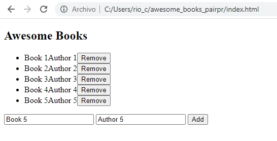

# awesome_books_pairpr

> Creating an Awesome Books Page

First project from Figma template

## Built With

- Html, Javascript
- Developed in VSCode

To get a local copy up and running follow these simple example steps.
Run:
- `git clone https://github.com/hunter4466/awesome_books_pairpr.git`
- `cd awesome_books_pairpr`
- Open index.html in browser

## Authors

👤 **Author**

- Mario Chois: [@githubhandle](https://github.com/hunter4466)
- Francis Uloko: [GitHub](https://github.com/francisuloko)
- Shabbir Yamani: [GitHub](https://github.com/smy5152)

## 🤝 Contributing

- Mario Chois: [@githubhandle](https://github.com/hunter4466)
- Francis Uloko [GitHub](https://github.com/francisuloko)
- Shabbir Yamani [GitHub](https://github.com/smy5152)

Contributions, issues, and feature requests are welcome!

Feel free to check the [issues page](https://github.com/hunter4466/awesome_books_pairpr/issues).

## Show your support

Give a ⭐️ if you like this project!

## 📝 License

This project is [MIT](./MIT.md) licensed.